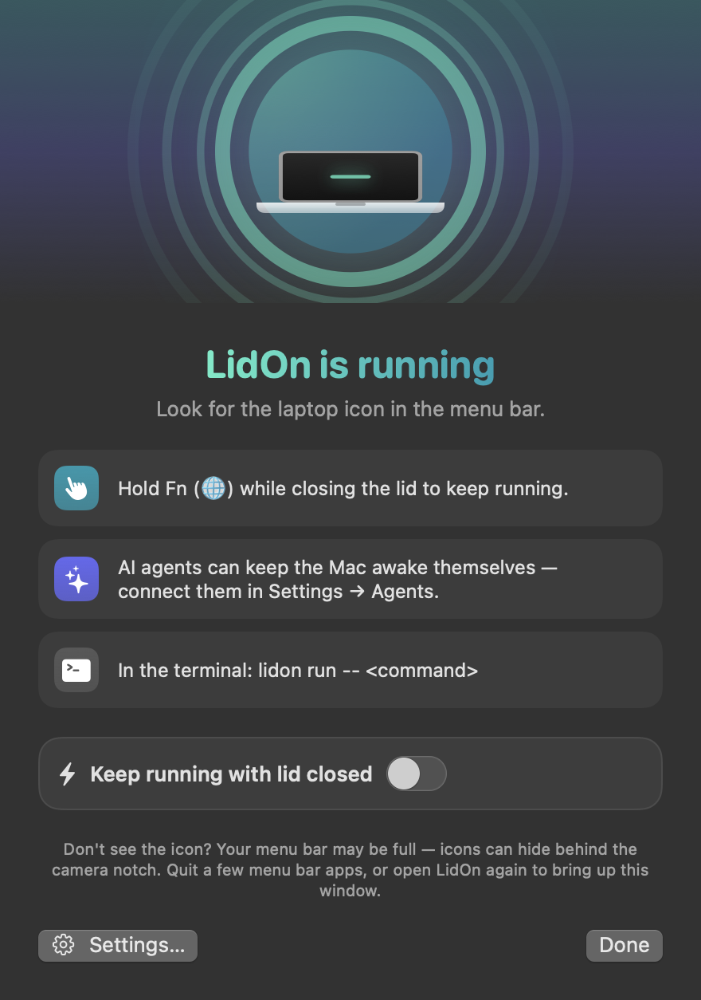
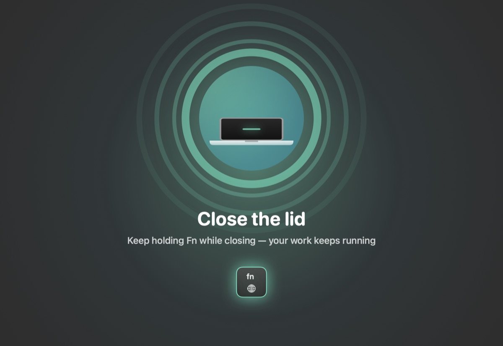

<p align="center"></p>

<h1 align="center">LidOn</h1>

<p align="center"><b>A free menu bar app that keeps your MacBook — and your coding agents — running with the lid closed.</b><br>
Claude Code · Codex · Cursor · builds · downloads — no external display or charger required.</p>

<p align="center"><a href="README.md">한국어</a></p>

<p align="center">
  
  &nbsp;
  
</p>
<p align="center">
  
</p>

---

## Features

- **Free and open source (MIT).** No sudo, no kernel extension.
- **Hold Fn (🌐) while closing the lid** to keep running, confirmed by a full-screen animation.
- **AI agents control it directly** via MCP (Claude Code plugin + skill, Codex, Cursor): `keep_awake` with a reason and time limit,
  `allow_sleep` when done, `notify` to ping your phone. Requests are released automatically if the agent session ends.
- **Manual toggle** from the menu bar, a timer, or ⌃⌥⌘L.
- **Safeguards:** thermal pressure, battery temperature, low battery, maximum run time.
- **Watchdog:** if LidOn crashes, is force-quit, or hangs, normal lid sleep is restored immediately.
- **Phone notifications** via ntfy, Slack, Discord, or a custom JSON webhook.
- **CLI:** `lidon run -- npm test` keeps the Mac awake only while the command runs; `lidon keep --for 2h`, `lidon release`, `lidon notify`.
- Global shortcut ⌃⌥⌘L, URL scheme `lidon://on?for=2h`, session history with battery stats.
- English and Korean.

## Install

```bash
curl -fsSL https://raw.githubusercontent.com/YOUR_GITHUB_ID/LidOn/main/install.sh | bash
```

or with Homebrew:

```bash
brew install --cask YOUR_GITHUB_ID/tap/lidon
```

or download `LidOn-x.y.z.zip` from [Releases](https://github.com/YOUR_GITHUB_ID/LidOn/releases).
LidOn is not notarized, so on first launch open **System Settings → Privacy & Security** and click **Open Anyway**,
or run `xattr -dr com.apple.quarantine /Applications/LidOn.app`.

Requires macOS 14 Sonoma or later on a MacBook (Apple silicon or Intel).

## Terminal

```bash
lidon run -- npm test              # keep running while the command runs, then sleep
lidon on --for 2h                  # 30m, 90m, 1h30m…
lidon off
lidon wait <pid>                   # keep running until a process exits
lidon status [--json]
```

## AI agents

Claude Code plugin (MCP server + skill):

```
/plugin marketplace add YOUR_GITHUB_ID/LidOn
/plugin install lidon@lidon
```

Or connect directly:

```bash
lidon setup claude     # MCP server (user scope) + skill in ~/.claude/skills/lidon
lidon setup codex      # ~/.codex/config.toml + skill in ~/.agents/skills/lidon
lidon setup cursor     # ~/.cursor/mcp.json
lidon setup --print    # print snippets only
```

Any other MCP client: register `lidon mcp` as a stdio server. Agents without MCP: paste `lidon agent-docs` into CLAUDE.md / AGENTS.md.

## Safety

Never run a closed MacBook inside a bag. Keep it on a hard, open surface, and plug it in for long jobs.
The watchdog always restores normal sleep if LidOn stops responding or the Mac reaches a critical temperature,
even when every safeguard is turned off. Watchdog events are logged to
`~/Library/Application Support/LidOn/watchdog.log`.

## How it works

LidOn calls the private `kPMSetClamshellSleepState` selector on `IOPMrootDomain`, which does not require root.
That kernel state survives the calling process, so LidOn launches itself in `--watchdog` mode and sends it a heartbeat
over a pipe. Because powerd can overwrite the same bit (for example when an external display is plugged or unplugged),
LidOn re-applies it every second while it is on. The state machine in `Sources/LidOnCore/Engine.swift` is pure and unit-tested.

This relies on an undocumented macOS interface. Please re-test after major macOS updates.

## Build

```bash
swift test
scripts/build-app.sh               # build/LidOn.app (universal)
```

## License

MIT
