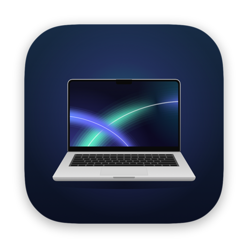
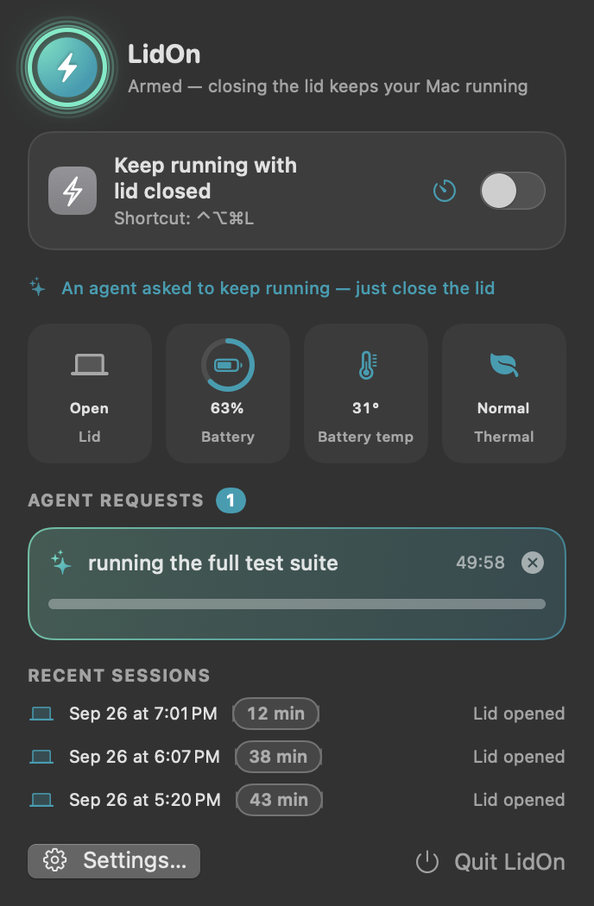
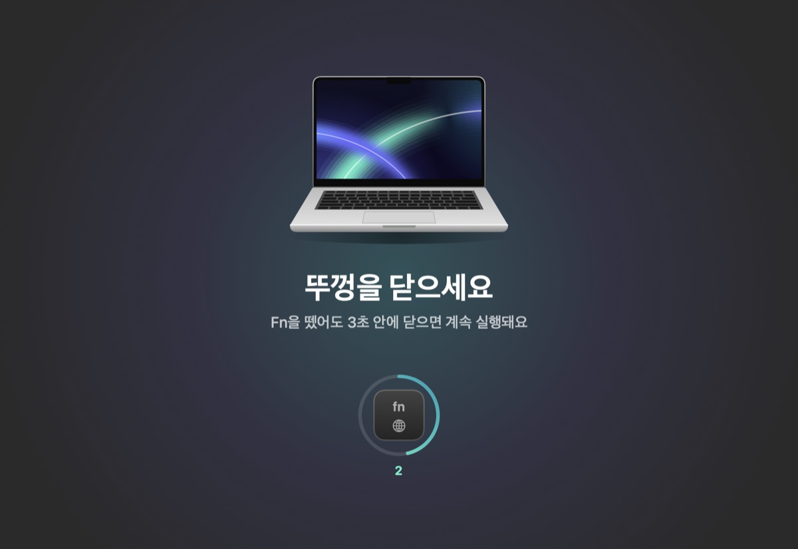

<p align="center"></p>

<h1 align="center">LidOn</h1>

<p align="center"><b>Close the lid. Keep working.</b><br>
A free, open-source macOS menu bar app that keeps your MacBook — and your AI coding agents — running with the lid closed.<br>
No external display, no charger, no <code>sudo</code>.</p>

<p align="center">
  <a href="https://github.com/jayden0903/LidOn/releases/latest"></a>
  
  
  <a href="README.ko.md"></a>
</p>

<p align="center"></p>

## Why

You start a long build, a test suite, a download — or you hand a task to Claude Code or Codex — and then you need to
close the lid and walk away. A MacBook goes to sleep and everything stops. `caffeinate` doesn't help once the lid closes,
and `pmset disablesleep` needs `sudo` and stays on until you remember to turn it off.

LidOn keeps the Mac running only while there's a reason to, and lets it sleep again as soon as that reason is gone.

## Install

```bash
brew install --cask jayden0903/tap/lidon
```

or

```bash
curl -fsSL https://raw.githubusercontent.com/jayden0903/LidOn/main/install.sh | bash
```

Both install `LidOn.app` into `/Applications` and put the `lidon` command on your `PATH`.
You can also download the zip from [Releases](https://github.com/jayden0903/LidOn/releases/latest) — LidOn isn't notarized yet,
so the first time, open **System Settings → Privacy & Security** and click **Open Anyway**.

Requires macOS 14 Sonoma or later on a MacBook (Apple silicon or Intel).

## Three ways to keep it running

| | How | Ends when |
|---|---|---|
| **Fn gesture** | Hold **Fn (🌐)** for half a second, then close the lid. You can let go of Fn — you have 3 seconds. | You open the lid |
| **Toggle** | Menu bar → *Keep running with lid closed*, for a set time or until you turn it off. Or press **⌃⌥⌘L**. | You turn it off or the timer ends |
| **Agents & terminal** | An AI agent calls `keep_awake`, or you run `lidon run -- <command>`. | The work finishes, the time runs out, or the agent session ends |

When the lid closes, LidOn locks the screen and turns the display off. When you open it, normal sleep is back.
If the lid is already closed but the Mac is still awake (an external display, or `lidon on` over SSH), turning it on takes effect right away.
If LidOn restarts — for example during an update — it picks up where it left off.
Pressing another key, clicking or scrolling while the Fn gesture is active cancels it. Moving the pointer is fine.

<p align="center">
  
  &nbsp;
  
</p>

## AI agents

LidOn doesn't guess whether an agent is busy. Agents ask for it themselves through an MCP server that ships with the app:

| Tool | What it does |
|---|---|
| `keep_awake(reason, minutes)` | Keep the Mac awake for a reason and a time limit (max 12 h). Replies with when it expires and any warnings (low battery, no phone notifications). |
| `allow_sleep()` | Release the request. If the lid is closed, the Mac goes to sleep. |
| `lidon_status()` | Lid, battery, temperature and active requests. |
| `notify(message)` | Notify you on the Mac and on your phone — and says where it actually got delivered. |

A request is released when the agent calls `allow_sleep`, when its time runs out, or when the agent session ends — even if it crashes.
A skill tells the agent when to use it: before work that may take ~5 minutes or more, whenever you ask, or when you say you're stepping away.

**Claude Code** — plugin (MCP server + skill):

```
/plugin marketplace add jayden0903/LidOn
/plugin install lidon@lidon
```

**Or connect in one command** (also in *Settings → Agents*):

```bash
lidon setup claude     # MCP server (user scope) + skill; LidOn's own tools run without prompts
lidon setup codex      # ~/.codex/config.toml + skill in ~/.agents/skills
lidon setup cursor     # ~/.cursor/mcp.json
lidon setup --print    # print the config snippets instead
```

Any other MCP client: register `lidon mcp` as a stdio server. Agents without MCP: paste `lidon agent-docs` into your `CLAUDE.md` or `AGENTS.md`.

## Terminal

```bash
lidon run -- npm test                        # awake only while the command runs
lidon keep --for 2h --reason "data migration" # prints an id (max 12h)
lidon release <id>
lidon wait <pid>                             # until a process exits
lidon notify "Build finished"                # Mac + phone notification
lidon on --for 2h / lidon off                # the menu bar toggle
lidon login-item on                          # launch at login
lidon status [--json]
```

URL scheme: `open "lidon://on?for=90m"`, `lidon://off`, `lidon://toggle` — handy from Shortcuts or Raycast.

## Phone notifications

*Settings → Notifications* supports [ntfy](https://ntfy.sh), Slack, Discord and a generic JSON webhook.
You'll hear about it when an agent calls `notify`, and right before the closed Mac goes to sleep (work finished, time ran out,
or a safeguard kicked in). LidOn waits up to 6 seconds for delivery before letting the Mac sleep.

## Safety

- **Heat:** sleeps when macOS reports serious thermal pressure or the battery reaches 45 °C (adjustable).
- **Battery:** sleeps at 10 % when unplugged (adjustable).
- **Watchdog:** a separate process restores normal sleep if LidOn crashes, hangs or is force-quit, or the Mac gets critically hot — even if every safeguard is turned off. Events are logged to `~/Library/Application Support/LidOn/watchdog.log`.
- **Never run a closed MacBook inside a bag.** Keep it on a hard, open surface, and plug it in for long jobs.

## FAQ

**How is this different from `caffeinate` or `pmset`?**
`caffeinate` prevents idle sleep, but a MacBook still sleeps when the lid closes (unless it's on power with an external display).
`pmset disablesleep 1` works but needs `sudo`, has no safeguards, and stays on until you undo it. LidOn needs no admin rights,
turns itself off when the reason is gone, watches heat and battery, and can be driven by agents.

**How does it work?**
It calls the private `kPMSetClamshellSleepState` selector on `IOPMrootDomain`, which doesn't require root. That kernel state
survives the calling process, so LidOn runs a watchdog that restores it if the app disappears. Because `powerd` can overwrite
the same bit (for example when a display is plugged in), LidOn re-applies it every second while it's on.

**Does it drain the battery?**
LidOn itself idles at roughly 0.1–0.3 % CPU. Animations only run while a LidOn window is visible. What drains the battery is the
work you keep running — so plug in for long jobs.

**Does it need special permissions?**
No Accessibility, Input Monitoring, Screen Recording or admin password. It asks for notifications (optional).
The Fn gesture reads key state, which macOS allows without permissions.

**Why isn't it notarized?**
It's a free side project without an Apple Developer account yet. The Homebrew cask and the install script clear the
quarantine flag for you. The source is all here.

**What if I plug in the charger or a display after closing the lid?**
macOS re-checks the lid when power or displays change and pushes the Mac toward sleep. LidOn catches this and keeps
the Mac running with the screen off for as long as it stays plugged in, and tells you about it. If you then unplug it, the Mac
sleeps — macOS only lets apps hold that state on power. For long jobs, plug in before closing the lid, or open and close the
lid again after plugging in.

**Will a macOS update break it?**
It relies on an undocumented interface, so it could. Please test again after major macOS updates and
[open an issue](https://github.com/jayden0903/LidOn/issues) if something changes.

**Intel Macs?**
Builds are universal. Intel hasn't been tested as much as Apple silicon — reports welcome.

## Uninstall

```bash
brew uninstall --zap --cask lidon      # or drag LidOn.app to the Trash
```

To remove agent integrations: *Settings → Agents → Disconnect*.

## Build from source

```bash
swift test                          # unit tests (state machine, parsers, config merging)
scripts/build-app.sh                # build/LidOn.app (universal)
ARCHS=arm64 scripts/build-app.sh    # current architecture only
```

Requires Xcode 16 or later. Releases are built by GitHub Actions when a `v*` tag is pushed; `scripts/update-tap.sh <version>`
updates the Homebrew tap.

## License

MIT
